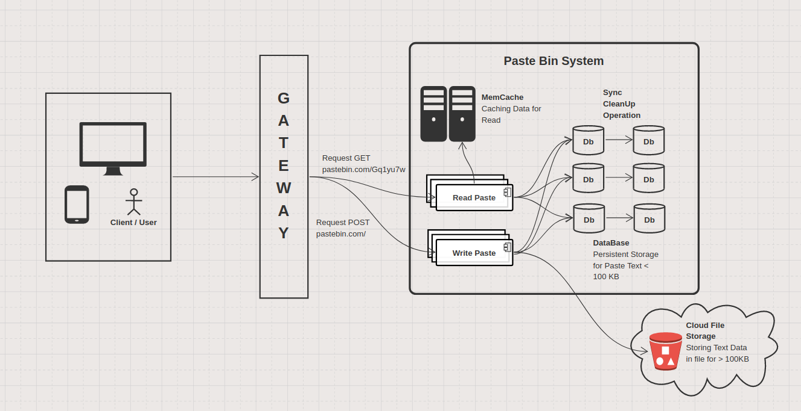

# PasteBin Service

  

    <a href="">Tutorial</a> |
    <a href="">Features</a> |
    <a href="">Documentation</a> |
    <a href="https://github.com/iqdf/Golumn/blob/master/.github/CONTRIBUTING.md">Contributing</a>
      
    
    

## What is PasteBin System?
PasteBin is a type of online content hosting service where users can store plain text, e.g. to source code snippets for code review via Internet Relay Chat. 
The first pastebin was the eponymous pastebin.com and has been popular up until now since 2002. 

-- Wikipedia: PasteBin.com

---

## Try out PasteBin Tutorial from Maka
We implement pastebin service in golang, just for fun and learning. You can follow our Medium tutorial [here].
* Join as contributor's to our community about system design, development, tutorial and more!
* Try out the PasteBin Demo server to leverage your system design beyond white board interview!

## Deploy on Heroku [WIP]

Note: Heroku preview does not include email or persistent storage

## Install on Your Own Machine 
* [One-line Docker Preview]()
* [Developer Machine Setup]()

---

## PasteBin System Design Tutorial

  

 

### 1. Functionality Requirements 

| No | Features | Description |
| ---- | --------------------- | ---------------------------------|
| 1  | **Write & Read Paste** | Users are able to write/create a paste,   each containing text (or source code) of  ** 10Mb **  at maximum. |                                                |
| 2  | **Unique URL Path**  | Users will get random unique short URL, typically **8 characters** (a-z, A-Z, 0-9) long when writing a paste.   The generated URL must be unique across the system and only map to one paste. |
| 3  | **Paste Expiry**     | Paste bin resource can be expired after *T*period.   Let's just say that every pastes will expired after 1 day and then, the system can reclaim the disk space. Alternatively, user can set the expiry to date, and that also means it can set to  *Never* just like the real [pastebin.com](pastebin.com).  |
| 4  | **User Login and Register** | User can register and login by providing credential, session token, or API Key (for scraping).
| 5  | **Public and Private Paste** | Registered user can set the pastes as private. Hence other users or anonymous cannot see the paste.

### 1. B Features that are NOT covered 
| No | Excluded Features | Description |
| ---- | --------------------- | ---------------------------------|
| 1 | **Paste update and editing** | Document editing feature will be covered in another system design series e.g. Design Google Docs or Overleaf LaTeX. |
| 2 | **Tiny URL Shortener** | Possible and scalable solution for Unique random URL generation is to implement a key generating service or use auto increment Primary key of the paste table as the key.   However, for simplicity I'm not going to implement key generating service for robust URL generation but this problem is similar to tinyURL shortener. Here is the tiny URL solution [here](https://www.youtube.com/watch?v=JQDHz72OA3c&t=1716s).   Simply using *UUID* is assumed enough and if necessary, the UUID generator can be replaced using the ZooKeeper service later. |

### 2. System Requirements 
Let's discuss how the ideal system looks like for a good Pastebin system.

1. **Durability** - Once you writen down, paste data can be retrieved. 
The challenge with storing paste text or blob is that you will run out of storage space quickly. 
We will also see another challenge when the read traffic surges high as we will have much higher read frequency. We will see this in the [Capacity Estimation](#Capacity-Estimation).
2. **High Availability** - Paste that (has been created and not expired yet), must be highly available at all times. 
Traffic might surge but user should be able to access the paste for a given URL and favorably with low latency.

### 3. Capacity Estimation 

#### 3. 1. Load Assumption daily

* Paste rate: 100K paste/day created
* Read rate: 10x Paste - this means on average, every paste created before will be viewed but 10.0 other users every day onwards. 
* On average, paste text has around 100Kb size. On worst/maximum, 10Mb size.

| Traffic   | Estimation |
| --------  | --------------------- |
| **Write** | 100K / day = 4,166/Hour = 150-200 /sec |
| **Read**  | 1M / day  = 1500-2000 / sec |

Hence, the storage we need per day:

| Data Storage    | Estimation |
| --------------- | ---------------------- |
| **Worst**       | 1000 Gb/day = 1 Tb/day |
| **Average**     | 10 Gb/day              |

Finally the **Read vs Write** ratio: **10 : 1**

#### 3. 2. Challenges and Question to Ponder

Hint: The bottleneck and the challlenge revolves around handling the bigger text blob when worst case occurs.

1. **Database and Text Storage** - You notice that the maximum 
text file is 10,000x the maximum file size. 
Now that the interviewer has hint you with both worst case and average case scenario, you need to cater for both cases. 
How would you store a smaller text data? How about the big one?

**Answer** : My approach for this problem is that we can store paste with smaller text data,  
100Kb or less in side the data store. 
For paste with bigger text data, we could save it to a file storage, let say AWS S3 Bucket or CloudStore. 
We then save the URL/Path where we save the file containing the text blob of a bigger paste. 
Ideally, we can also save a small snippet or preview of the text blob. 
When the client receives the bigger paste, 
it will first preview few lines of the text while at the same time download the whole text from the given cloud storage URL.

I think the real [pastebin.com](pastebin.com) uses 512Kb as their 
threshold from my research but I'm not sure though. 
Feel free to play around with the numbers.

2. **Caching for Read** - You also notice that since the Read 
operation is 10x the Write. From the above estimation, *2000 request/sec* might seem normal and nothing to be afraid of. 
However, you must remember that for every read, a plenty of text blob could bloat the I/O bandwidth used to retrieve the data from data storage and this would be your bottleneck. 
Hence you would think cache is the solution?
If you store very big blob of text in memory cache, your CPU usage would surge like crazy doesn't it?

**Answer**: As the previous answer has stated, saving bigger text data in cloud store and 
just store the URL give a big help for handling large text. 
It will also save your memcache for exploding, 
such that you don't need to cache the whole text if it is too big but instead, 
just cache the preview of it. 
Cache can be used after 2 calls to the same short Paste URL, hence reducing the Read operation to DB by 8 times. 
You can use LRU Cache to rotate and reclaim some memory blocks so that your CPU RAM doesn't spike up.

### 4. [WIP] PasteBin APIs

Defining PasteBin API (WIP)

#### `create_paste(api_key, short_url, expiry_date, text_data)`

Parameters:

Returns: 
* Status `HTTP302` redirect status
* Short URL Path: Newly generated unique 8-chars URL.

#### `get_Paste(api_key, short_url)`

Parameters:

Returns:

### 5. Database Schema

The PasteBin system has a straight forward design for database schema. 
It doesn't have complicated entity relationship. In such case, using either SQL or NoSQL is fine

in my opinion but I prefer NoSQL because it has slightly (but arguably) faster read and write. 
It's *arguably* because it depends on which NoSQL vs SQL DB you use to compared with. 
I also like NoSQL because its quite simply and straight forward to 
convert from JSON data because the document format looks alike. 

But in my view, the advantage of NoSQL in this case is marginal compare to SQL DB.

#### 5. 1. Paste Entity:
| Paste Attributes | Data Type     | Description |
| ---------------- | ------------- | --------------------------------- |
| `paste_id`       | int (auto increment) | Primary Key, AutoIncrement and Unique Index |
| `short_url_path` | string        | URL Path of the paste. Unique (across the entire system) |
| `text_data`      | string / text | String which is the Text Data or the Preview of it. |
| `storage_link`   | string (url/uri)  | URL string to download the paste data. Can be empty ("") if the paste doesn't need to be stored in cloud ( size < 100KB) |
| `owner_user_id`  | int           | ID of the user who creates and owns the paste. It could be anonymous user. The data type depends on how your design you user service; you can use int auto-increment (easier) or string (like Google Account).
| `private`        | bool          | Whether other user else the owner can retrieve |
| `created_at`     | datetime      | Date time of paste creation |
| `expired_at`     | datetime      | Date time which paste become expired |

#### 5. 4. User Entity
| User Attributes | Data Type     | Description |
| --------------- | ------------- | --------------------------------- |
| `user_id`       | int (auto increment/random) | Primary Key, AutoIncrement and Unique |
| `name`          | string        | name of the user            |
| `metadata`      | struct/object | metadata that describe user |

### 6. System Architecture design

  

 

Here is our architecture. Let's discuss several keys here:

#### 6. 1. Handling Write Request

**URL Generation** - As promised, I'm keeping this solution 
simple, hence I'll generate a random unique key using UUID v4 
generator. UUID v4 almost guarantee a completely unique ID, unless 
you generate it from the same computer, and at the exact same time. 

However, there is now a chance that a UUID could be duplicated. 
The question is, do you need to worry about it?

The short answer is no. With the sheer number of possible combinations (2^128), 
it would be almost impossible to generate a duplicate unless you 
are generating trillions of IDs every second, for many years.

**Receving Text Blob** - To start with I'll just assume HTTP 
protocol for communication between the client to the Gateway. 
HTTP methods `POST` and `PUT` that will be used doesn't have any 
limit data size for request body.
Some service and reverse proxy normally limit the size to **10-20Mb**. 
From the web browser (client) side, the safe size is **2Kb**.

For that, the client side might want to upload a very, very big 
text data as a file using content-type: `application/multipartform`.
You can also tweak your gateway to take more payload per request.

**Handling Text Storage** - Now, for the storage part, we will check the text data or the file size that the client send over. If this is too big to be stored in DB (in our case, size > 100KB ) then we will put it in a cloud storage and schedule a background job to upload the text blob. We will also store its snippet or preview text in the database as well. For smaller text data, we just insert entirely in the database.

As a side note, you can set the `short_url_path` as unique index constraint so that when you look for the paste in the DB, it will find it faster at the cost of having extra space to add a B-tree index.

**Expiring Paste** - One way to do it is to schedule a regular job for every 10 minute, 1 hour, or daily to see which paste can be removed based on its expiry timing. 
Some DBs like MongoDB support this feature out of the shelf.
For MongoDB, it wait every 60 seconds before executing task to find and remove stale entries. Of course, you can always configure the setting to every minute or hour, or several days. 

#### 6. 2. Handling Read Request

**Reading Smaller Text (size < 100Kb)** - For smaller text, we can directly fetch the data from database and send it to the client using HTTP. 
Paste with smaller text doesn't need storage URL because none of its data is uploaded to the cloud.

**Reading Bigger Text (size > 100Kb)** - For bigger text, we can first retrieve the text data which is just the preview/snippet of it from database and send it to the client using HTTP. 
We will also send the cloud storage URL. 
Tbh, having preview is optional but give a nicer user experience on client side later on. 

Paste with bigger text has its data uploaded to a cloud storage, 
hence the client will need to download them using the given link.
Make sure you have set the permission wisely for your cloud storage, e.g. client need to have a token or API Key to download them to prevent from request spammer.

Alternatively, the server can download the file from cloud storage and stream them for the client after sending the text preview.

**Caching Read** - After 2nd `GET`call to the same url, we can cache the paste information in Memory Cache.
Your application will then check for the cached paste in memcache for every `GET` request if it is in the memcache, take it from there and no need to hit the DB. 
Otherwise retrieve the data from DB.
Also make sure you track the request for each url so that after the 2nd call, well you know what to do.

In the cache itself, same thing goes for bigger text. Only store the preview of the text in memcache if the size is too big.

When you have limited RAM in the machine you can apply some memory rotation algorithm such as LRU algorithm.
Some memcache like [Redis](), or [Mem Cache]() support LRU style caching.

Don't forget to purge expired paste as well. Redis supports purging expired data provided the time in seconds.

## Maintainers

I'm Daniel Kurniadi [[iqDF](github.com/iqdf)] at Maka.AI.
Welcome to my tutorials!